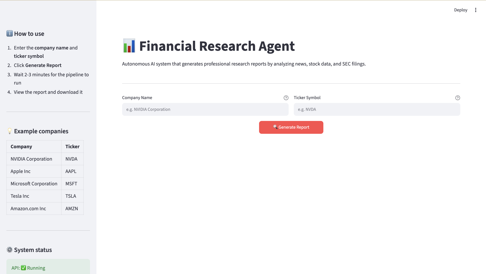
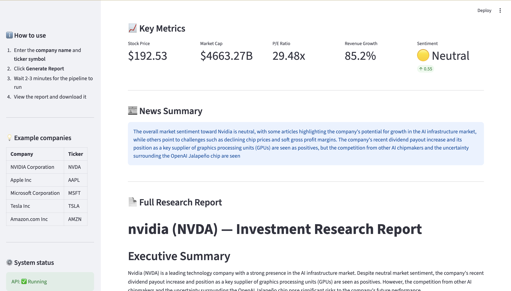

# 📊 Autonomous Financial Research Agent

An end-to-end multi-agent AI system that automatically generates professional financial research reports by analyzing real-time news, live stock data, and SEC 10-K filings.

> Built with LangGraph, RAG, ChromaDB, NVIDIA NIM, FastAPI, and Streamlit.

---

## 🎯 What It Does

A manager enters a company name and ticker symbol. The system automatically:

1. Fetches top 10 recent news articles and analyzes market sentiment
2. Pulls live stock metrics from Yahoo Finance
3. Downloads and analyzes the latest SEC 10-K annual filing using RAG
4. Synthesizes everything into a structured investment research report
5. Delivers the report via email and displays it on a web dashboard

**What would take a human analyst 4-5 hours takes this system 30-40 seconds.**

---

## 🖼️ Screenshots

<!-- Add your screenshots here -->
> Dashboard — Enter company name and ticker, click Generate Report



> Generated Report — Full investment research report with key metrics



---

## 📄 Sample Reports
- [NVIDIA Research Report](sample_reports/NVDA_research_report_NIM.md)
- [Microsoft Research Report](sample_reports/MSFT_research_report_NIM.md)

## 🏗️ Architecture

```
Manager (Dashboard)
        ↓
FastAPI (POST /analyze)
        ↓
LangGraph Pipeline
        ↓
Orchestrator → validates inputs, creates research plan
        ↓ (parallel execution)
┌───────────────┬───────────────┬───────────────┐
│ Research Agent│  Data Agent   │ Filing Agent  │
│ News+Sentiment│ Yahoo Finance │ SEC 10-K RAG  │
└───────────────┴───────────────┴───────────────┘
        ↓ (all 3 complete)
Report Agent → synthesizes → emails report
```

### RAG Pipeline (inside Filing Agent)

```
SEC EDGAR (10-K) → Document Loader → Chunker → Embedder → ChromaDB
                                                               ↓
                                                          Retriever (agentic)
                                                               ↓
                                                        LLM Extraction
```

---

## ⚙️ Tech Stack

| Component | Technology |
|-----------|-----------|
| LLM (cloud) | NVIDIA NIM — meta/llama-3.1-8b-instruct |
| LLM (local) | Ollama — deepseek-r1:8b / llama3 |
| Embeddings | mxbai-embed-large via Ollama |
| Vector DB | ChromaDB (local) |
| Pipeline | LangGraph |
| News Search | Tavily API |
| Stock Data | yfinance (Yahoo Finance) |
| SEC Filings | SEC EDGAR API |
| Email | SendGrid |
| API | FastAPI |
| Dashboard | Streamlit |
| Tracing | LangSmith |

---

## 🚀 Quick Start

### Prerequisites

- Python 3.10+
- [Ollama](https://ollama.ai) installed and running
- API keys (see `.env.example`)

### 1. Clone the repository

```bash
git clone https://github.com/kirti2k23/financial-research-agent.git
cd financial-research-agent
```

### 2. Create virtual environment

```bash
python -m venv .venv
source .venv/bin/activate  # Mac/Linux
```

### 3. Install dependencies

```bash
pip install -r requirements.txt
```

### 4. Pull Ollama models

```bash
ollama pull mxbai-embed-large
ollama pull deepseek-r1:8b
```

### 5. Set up environment variables

```bash
cp .env.example .env
# Edit .env and add your API keys
```

### 6. Run the API

```bash
uvicorn src.api.main:app --port 8000
```

### 7. Run the dashboard

```bash
# In a second terminal
streamlit run dashboard/app.py
```

### 8. Open in browser

```
http://localhost:8501
```

Enter a company name and ticker, click **Generate Report**.

---


## 🤖 Supported LLM Providers

Switch between providers with one line in `.env`:

```env
LLM_PROVIDER=ollama   # local, free, runs on your GPU
LLM_PROVIDER=nim      # NVIDIA cloud GPU, faster, free tier
```

| Provider | Model | Speed | Cost |
|----------|-------|-------|------|
| Ollama | deepseek-r1:8b | ~50s | Free |
| Ollama | llama3 | ~55s | Free |
| NVIDIA NIM | llama-3.1-8b-instruct | ~30s | Free tier |

---

## 📊 Sample Report Structure

Every generated report follows this structure:

```
# Company (TICKER) — Investment Research Report

## Executive Summary
## Market Sentiment
## Financial Snapshot
## Business Segments & Revenue
## Key Risk Factors
## Management Outlook
## Investment Considerations
## Disclaimer
```

---

## 🔍 Key Technical Decisions

**Why RAG instead of fine-tuning?**
10-K filings change every year. RAG retrieves from the latest filing in real time. Fine-tuning would require retraining every time a new filing is released.

**Why parallel agents?**
Research, data, and filing agents are independent. Running them in parallel reduces pipeline time from ~27s sequential to ~30s total (bottleneck is the filing agent).

**Why 400 token chunks?**
Financial paragraphs in 10-K filings average 200-400 words. 400 tokens captures one complete financial concept without mixing topics — optimal for both retrieval precision and RAGAS evaluation.

**Why ChromaDB?**
Local, no setup, persists to disk. For an MVP analyzing one company at a time, local ChromaDB is sufficient. Production would use Pinecone or Qdrant.

---

## 🗺️ Roadmap

- [x] Multi-agent pipeline with LangGraph
- [x] Agentic RAG with sufficiency checking
- [x] NVIDIA NIM integration
- [x] FastAPI + Streamlit full stack
- [ ] RAGAS evaluation system
- [ ] Cloud deployment (Railway/Render)
- [ ] Support for multiple companies simultaneously
- [ ] Historical report storage
- [ ] LangSmith tracing dashboard

---

## 📄 License

MIT License — free to use, modify, and distribute.

---

*Built as a portfolio project demonstrating multi-agent AI system design with production-grade architecture.*